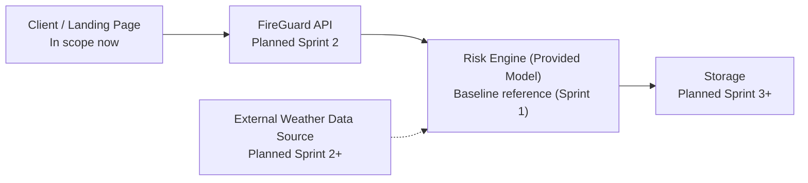

## 1) Title + 1-liner
**FireGuard - Sprint 1**  
Foundation sprint for a fire risk indication service concept aimed at wooden buildings.

## 2) Sprint 1 scope statement (foundation)
Sprint 1 is about setup: repo, backlog, architecture draft, and CI checks.  
CI/CD pipeline (Sprint 1: Continuous Integration checks only; deployment is out of scope).

## 3) What FireGuard aims to become (service concept)
- A service that indicates daily fire risk for wooden buildings
- A model-driven workflow that later uses weather inputs
- A practical decision-support tool for building managers

## 4) Sprint 1 deliverables
- Clean repository and baseline code structure
- Backlog with features, stories, and criteria
- Initial architecture diagram
- CI workflow on push and pull request
- Sprint 2 backlog ready

## 5) Backlog snapshot (features + 3 key user stories)
Features:
- Repository + workflow baseline
- Model reference + minimal demonstrator
- CI quality gate

Key user stories:
- As a building manager, I want a deterministic risk indicator, so that I can compare risk between days.
- As a product owner, I want a clear backlog, so that Sprint 2 starts with actionable tasks.
- As a team member, I want CI checks on push/PR, so that basic issues are caught early.

## 6) Architecture diagram (same as README)

## 7) CI/CD proof (what pipeline does in 1-2 lines)
GitHub Actions runs on each push and pull request.  
It compiles Python files and runs unit tests if a `tests/` folder exists.

## 8) Sprint 2 plan
- Run and document one baseline model execution
- Define API contract for risk input/output
- Add input validation
- Implement minimal `/risk` endpoint stub
- Add baseline tests

## 9) Out of scope
- Authentication and JWT
- Database implementation
- Messaging/broker integration
- Full MET weather integration
- Deployment hosting architecture
- Production security and observability stack
